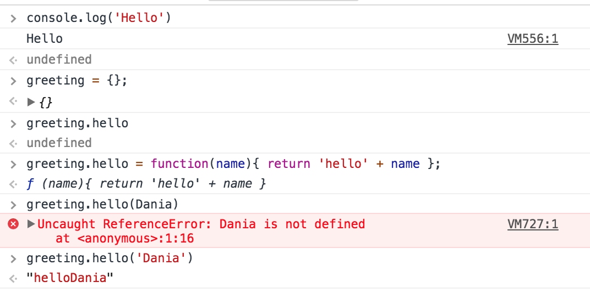

# Javascript Exercises

In this repository, over Christmas I wanted to do a crash course/reflection on Javascript.
This was my chance to test myself and cement my knowledge on javascript syntax. The image above is an exercise to get myself familiar with Javascript once again.

In this repository, there is the following.

- Basic example of Javascript Exercises
- FizzBuzz Challenge
- It's test done with Jasmine
